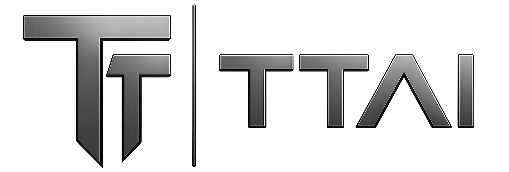
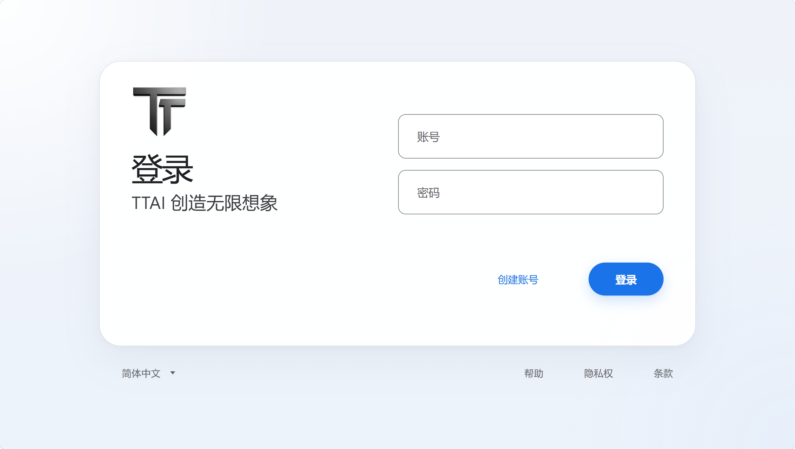
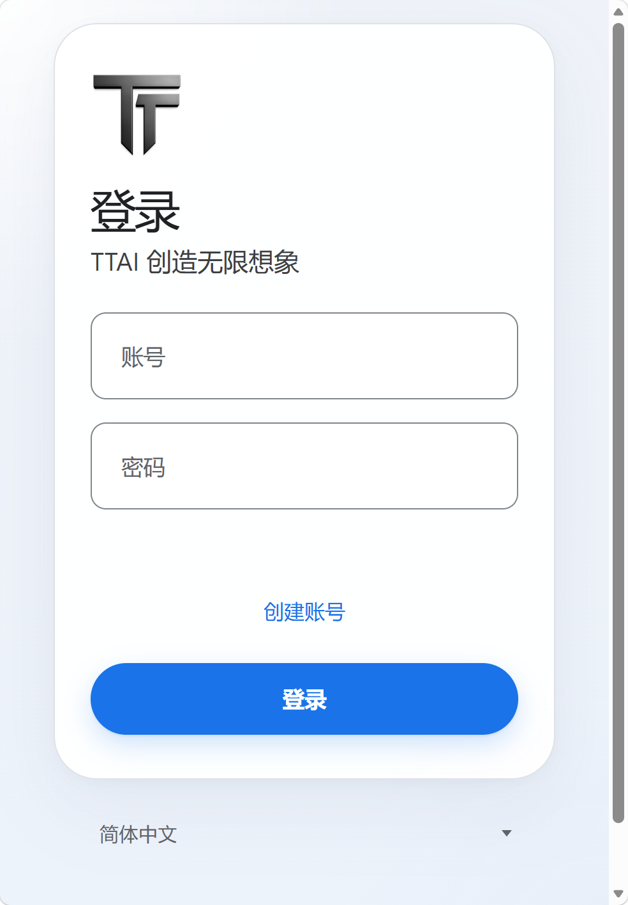
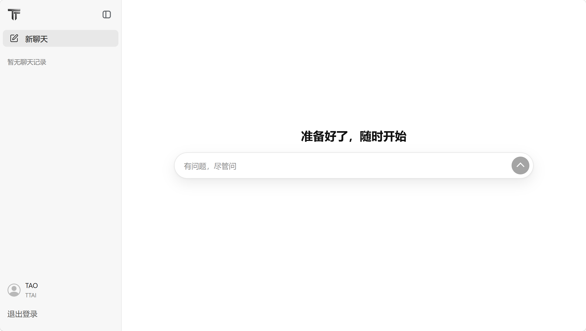
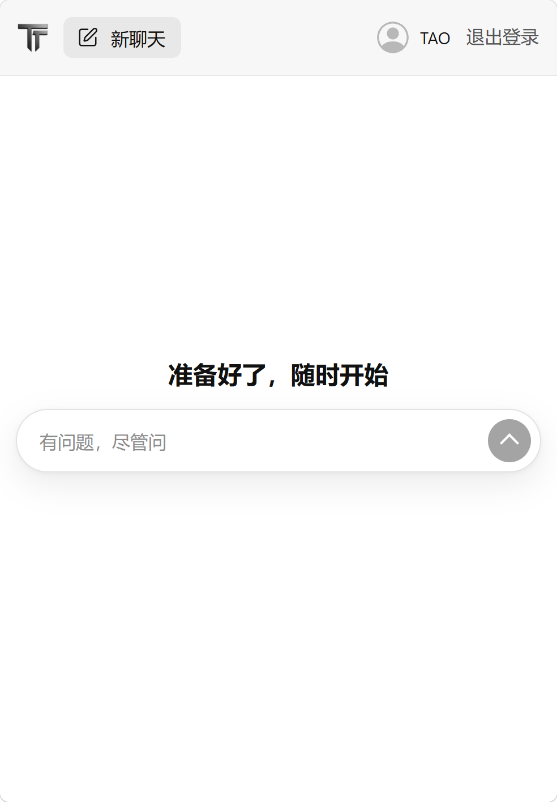
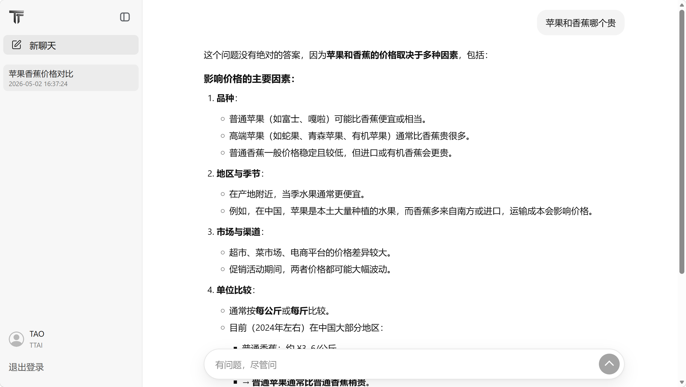
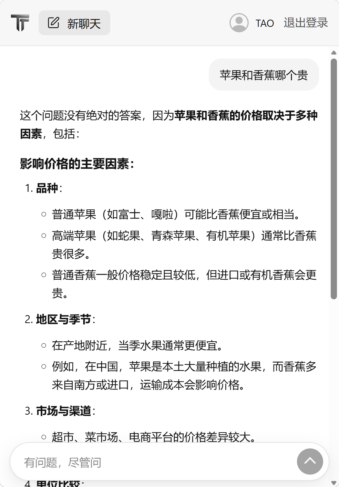

<div align="center">
  
  <p style="font-size: 20px; margin: 8px 0 2px;"><strong>Author: Taotao Lyu</strong></p>
  <p style="font-size: 18px; margin: 0;">
    <a href="#english">English</a>
    |
    <a href="#中文">中文</a>
  </p>
</div>

<a id="english"></a>

## TTAI

TTAI is a high-performance AI chat platform whose backend is built entirely with C++. It combines a React frontend, the Muduo event-driven networking library, a self-developed HTTP/HTTPS server framework, a self-developed MySQL connection pool, and DashScope streaming large-model APIs. By using Muduo, the backend implements a Reactor-based I/O multiplexing model, improving concurrent access capacity and overall throughput. The project implements user authentication, cookie-based sessions, streaming AI conversation, persistent chat history, AI-generated chat titles, and multi-session chat management, while separating the networking layer, TLS layer, routing layer, database layer, model strategy layer, and frontend presentation layer into clear modules.

## ✨ Features

### 🤖 AI Chat

- Supports real-time AI conversation with streaming responses.
- Calls Alibaba Cloud DashScope models through libcurl.
- Uses SSE (Server-Sent Events) to forward model output chunks to the browser as soon as they arrive.
- Uses `@microsoft/fetch-event-source` on the frontend to receive streaming data.
- Supports Markdown rendering for AI responses, including lists, tables, code blocks, quotes, and links.

### 👤 User System

- Supports account registration, login, and logout.
- Generates a random `sessionId` during registration and stores it in MySQL.
- Sends the `sessionId` to the browser through `Set-Cookie` after successful login.
- Validates API access through the `sessionId` stored in cookies.
- Performs basic username and password validation, allowing only letters and digits.

### 💬 Multi-Session Chat History

- Each user can create multiple chat sessions.
- The sidebar displays session titles and creation time.
- Clicking a historical session loads its full message history through `/history`.
- The backend caches the active session in `ChatRecord` to reduce repeated database reads and writes.
- New messages are incrementally written back to MySQL when switching sessions or shutting down the service.

### 🏷️ AI-Generated Titles

- The first message of a new session triggers the `/title` endpoint.
- The backend asks the model to generate a concise title based on the user's first message.
- Generated titles are stored in `chat_sessions` and displayed in the sidebar.
- If the title is empty or still `New Chat`, the backend regenerates it until a short title is produced.

### 🌐 Static Frontend Hosting

- The C++ backend can serve both APIs and Vite-built frontend assets.
- `/` and static asset paths are handled by `AIHomePage`.
- `/chat` is handled by `AIChatPage` and requires a valid login cookie.
- In production, the frontend and backend can be deployed on the same origin.

## 🧰 Tech Stack

### ⚙️ Backend

- **C++17**: Implements core business logic, networking, database access, and AI requests.
- **Muduo**: Provides the Reactor event loop, TCP server, thread pool, and buffer abstraction.
- **OpenSSL**: Adds HTTPS support through memory BIO integration with Muduo TCP connections.
- **libcurl**: Sends requests to DashScope APIs and handles streaming callbacks.
- **nlohmann/json**: Handles configuration, request parsing, response construction, and model payloads.
- **MySQL Connector/C++**: Executes MySQL operations through prepared statements.
- **CMake**: Organizes `http_server`, `mysql_pool`, `ttai`, and the final executable.

### 🎨 Frontend

- **React 19**: Builds the login page and chat interface.
- **Vite**: Handles frontend development and multi-entry builds.
- **@microsoft/fetch-event-source**: Receives SSE streaming responses from the backend.
- **react-markdown + remark-gfm + remark-breaks**: Renders Markdown, GFM tables, and line breaks.
- **Responsive CSS**: Supports desktop and mobile layouts for login, chat, sidebar, and message views.

### 🗄️ Database

TTAI uses MySQL to persist users, sessions, and messages:

- `user`: Stores accounts, passwords, and the current `sessionId`.
- `chat_sessions`: Stores user sessions, titles, creation time, and message counts.
- `chat_messages`: Stores user and assistant messages for each session.

## 🚀 Technical Highlights

### 1. 🧩 Self-Developed HTTP Server Framework

The project does not rely on a ready-made web framework. Instead, it builds an HTTP layer on top of Muduo TCP Server:

- `HttpContext` parses the request line, headers, query parameters, and body.
- `HttpRequest` stores method, path, headers, body, and connection objects.
- `HttpResponse` assembles HTTP response messages.
- `Router` supports exact routes and regex routes.
- `HttpServer` manages connections, dispatches requests, handles CORS, and sends responses.

This design clearly demonstrates how an HTTP service turns TCP data into business handlers, and it leaves room for future middleware, authentication, logging, and parameter parsing.

### 2. 🔒 HTTPS Integrated With Muduo

The project integrates TLS through OpenSSL memory BIO:

- Muduo still manages the TCP connections.
- `SslConection` handles TLS handshake, encryption, and decryption.
- Encrypted data is sent through Muduo.
- Decrypted data is passed to the HTTP parser.

This keeps Muduo's event-driven network model while adding HTTPS support for browser cookies, credentialed requests, and deployment scenarios.

### 3. ⚡ Streaming AI Responses With SSE

The `/send` endpoint uses DashScope SSE to provide a real chat experience:

- The backend first responds with `Content-Type: text/event-stream`.
- libcurl continuously reads chunks returned by the model.
- Each parsed `data:` block is immediately forwarded to the frontend.
- The frontend appends each delta to the active assistant message.
- The backend sends `data:[DONE]` when generation is complete.

This avoids waiting for a full response before rendering, improving first-token latency and user experience.

### 4. 🧠 Model Strategy Factory

Different model payload formats and message structures are abstracted through `AIStrategy`:

- `AliMultimodal` adapts DashScope multimodal message format.
- `AliTextGen` reserves support for text-generation format.
- `StrategyFactory` registers and caches strategy instances.

The chat handlers depend only on the strategy interface, so adding or replacing model providers requires less change to `/send`, `/history`, and `/title`.

### 5. ♻️ MySQL Connection Pool

The project implements `DbConnectionPool`:

- Pre-creates multiple connections at startup.
- Uses a condition variable to wait for available connections.
- Returns connections automatically through custom `shared_ptr` release logic.
- Runs `ping` before using a connection.
- Uses a background thread to periodically check connection health and reconnect when needed.

The pool reduces the cost of repeatedly creating MySQL connections and keeps database access simple through `executeQuery` and `executeUpdate`.

### 6. 🛡️ Prepared Statement Binding

Database access uses prepared statements:

- SQL and parameters are separated.
- Usernames, passwords, session IDs, and chat IDs are bound as parameters.
- This is easier to maintain than string-concatenated SQL and helps reduce SQL injection risks.

### 7. 🌍 Same-Origin Frontend Deployment

The built frontend can be hosted directly by the C++ backend:

- In production, `VITE_API_BASE_URL` can be empty.
- Login pages, chat pages, static assets, and API endpoints can share one port.
- This reduces the need for an extra static file server or reverse proxy during simple deployment.

## 🏗️ Architecture

TTAI uses a layered architecture so business logic does not directly handle sockets, TLS, HTTP parsing, or SQL connection details.

- **Infrastructure layer**: `http_server` and `mysql_pool`. They provide HTTP/HTTPS networking, routing, response sending, database connection reuse, health checks, and SQL execution.
- **Business layer**: `TTAI`. It handles accounts, sessions, chat, history, title generation, AI strategies, and static page hosting.
- **Frontend layer**: `TTAI-Web`. It handles login and registration UI, chat interaction, sidebar sessions, Markdown rendering, and streaming output.

The main advantage is separation of concerns: the network layer can be reused, the database pool can be tested independently, the business layer focuses on product logic, and the frontend focuses on user experience.

## 🔌 Main APIs

| API | Method | Description |
| --- | --- | --- |
| `/register` | POST | Register an account and set a cookie |
| `/login` | POST | Login and set a cookie after password validation |
| `/logout` | POST | Clear the browser cookie |
| `/send` | POST | Send a user message and receive an SSE streaming AI response |
| `/history` | POST | Load message history for a chat session |
| `/title` | POST | Generate and return a chat title from the first message |
| `/alltitle` | POST | Load all chat titles for the current user |
| `/chat` | GET | Validate login state and return the chat page |
| `/...` | GET | Serve frontend static assets or the login page |

## 🖼️ Project Preview

### 🔐 Login And Registration

The desktop login page uses a centered card layout with the TTAI logo, product tagline, account input, password input, and login/register switching. The mobile page reorganizes the same features vertically.

<div align="center">
  
  
</div>

### 💬 Chat Home

The chat home page provides new chat creation, historical sessions, user information, logout, and an empty-state prompt. On mobile, the sidebar actions are reorganized into the top navigation.

<div align="center">
  
  
</div>

### ⚡ Streaming Chat And Markdown Rendering

After sending a message, the user bubble appears on the right and the AI response streams into the main reading area. Markdown content is rendered directly in the conversation.

<div align="center">
  
  
</div>

## ⚡ Quick Start

The following is the shortest path to run the full project according to the current source code. The backend expects a Linux/WSL environment with Muduo, OpenSSL, libcurl, MySQL Connector/C++, nlohmann-json, MySQL, and Node.js installed.

### 🎨 1. Build The Frontend

```bash
cd TTAI-Web
npm install
npm run build
cd ..
```

### 🗄️ 2. Initialize MySQL Tables

```sql
CREATE DATABASE IF NOT EXISTS ttai DEFAULT CHARSET utf8mb4 COLLATE utf8mb4_unicode_ci;
USE ttai;

CREATE TABLE IF NOT EXISTS user (
  id BIGINT UNSIGNED NOT NULL AUTO_INCREMENT,
  username VARCHAR(255) NOT NULL,
  password VARCHAR(255) NOT NULL,
  session_id VARCHAR(255) NOT NULL,
  salt VARCHAR(255) DEFAULT NULL,
  PRIMARY KEY (id),
  UNIQUE KEY uk_username (username),
  KEY idx_session_id (session_id)
) ENGINE=InnoDB DEFAULT CHARSET=utf8mb4 COLLATE=utf8mb4_unicode_ci;

CREATE TABLE IF NOT EXISTS chat_sessions (
  id BIGINT UNSIGNED NOT NULL AUTO_INCREMENT,
  user_id BIGINT UNSIGNED NOT NULL,
  chat_id BIGINT UNSIGNED NOT NULL,
  title VARCHAR(255) DEFAULT 'New Chat',
  message_count BIGINT UNSIGNED NOT NULL DEFAULT 0,
  created_at TIMESTAMP NOT NULL DEFAULT CURRENT_TIMESTAMP,
  PRIMARY KEY (id),
  UNIQUE KEY uk_user_chat (user_id, chat_id),
  KEY idx_user_id (user_id)
) ENGINE=InnoDB DEFAULT CHARSET=utf8mb4 COLLATE=utf8mb4_unicode_ci;

CREATE TABLE IF NOT EXISTS chat_messages (
  message_id BIGINT UNSIGNED NOT NULL AUTO_INCREMENT,
  session_id BIGINT UNSIGNED NOT NULL,
  message_index BIGINT UNSIGNED NOT NULL,
  role VARCHAR(32) NOT NULL,
  content MEDIUMTEXT NOT NULL,
  created_at TIMESTAMP NOT NULL DEFAULT CURRENT_TIMESTAMP,
  PRIMARY KEY (message_id),
  UNIQUE KEY uk_session_message (session_id, message_index),
  KEY idx_session_id (session_id)
) ENGINE=InnoDB DEFAULT CHARSET=utf8mb4 COLLATE=utf8mb4_unicode_ci;
```

### 📝 3. Prepare The Configuration File

The current `TTAI/app/main.cpp` reads `/home/ltt/TTAI/build/config.json` by default. The simplest way is to place the project at `/home/ltt/TTAI` and create `config.json` inside the `build` directory:

```json
{
  "log": {
    "file": "/home/ltt/TTAI/build/ttai.log"
  },
  "ssl": {
    "enable": true,
    "cert_file": "/home/ltt/TTAI/build/server.crt",
    "key_file": "/home/ltt/TTAI/build/server.key"
  },
  "server": {
    "port": 8080,
    "thread_num": 5
  },
  "web": {
    "home": "/home/ltt/TTAI/TTAI-Web/dist",
    "chat": "/home/ltt/TTAI/TTAI-Web/dist/chat"
  },
  "chat": {
    "history_dir": ""
  },
  "mysql": {
    "host": "127.0.0.1",
    "port": 3306,
    "user": "root",
    "password": "your_mysql_password",
    "database": "ttai",
    "pool_size": 5
  },
  "model": {
    "api": "your_dashscope_api_key",
    "name": "your_dashscope_model_name"
  }
}
```

Browser login depends on the `Secure` cookie written by the backend, so HTTPS is recommended. For local testing, you can generate a self-signed certificate:

```bash
openssl req -x509 -newkey rsa:2048 -nodes \
  -keyout /home/ltt/TTAI/build/server.key \
  -out /home/ltt/TTAI/build/server.crt \
  -days 365 \
  -subj "/CN=localhost"
```

### ⚙️ 4. Build And Start The Backend

```bash
cmake -S . -B build
cmake --build build -j
./build/TTAI
```

The program daemonizes after startup and writes logs to `log.file` in `config.json`. Open:

```text
https://localhost:8080/
```

---

<a id="中文"></a>

## TTAI 中文版

[Back to English](#english)

TTAI 是一套以后端全栈 C++ 打造的高性能 AI 聊天平台，围绕 React 前端、Muduo 事件驱动网络库、自研 HTTP/HTTPS 服务框架、自研 MySQL 连接池，以及 DashScope 流式大模型接口构建而成。通过使用 Muduo，后端实现了基于 Reactor 的 I/O 多路复用模式，提高了并发访问能力和整体吞吐量。它不仅实现了登录注册、Cookie 会话、AI 流式对话、历史消息持久化、AI 自动标题和聊天列表管理，还把网络层、TLS 层、路由层、数据库层、模型策略层和前端展示层拆成清晰模块，适合学习 C++ 网络服务、AI 应用后端和全栈聊天系统的完整实现方式。

## ✨ 项目功能

### 🤖 AI 聊天

- 支持用户发送消息并实时接收 AI 回复。
- 后端通过 libcurl 调用阿里云 DashScope 大模型接口。
- 使用 SSE（Server-Sent Events）将模型增量输出直接推送到浏览器，用户不需要等待完整回复生成完成。
- 前端使用 `@microsoft/fetch-event-source` 接收流式数据，并逐字追加到当前 assistant 消息中。
- 支持 Markdown 渲染，包含列表、表格、代码块、引用、链接等常见 AI 回复格式。

### 👤 用户系统

- 支持账号注册、账号登录和退出登录。
- 注册时生成随机 `sessionId`，并写入 MySQL。
- 登录成功后通过 `Set-Cookie` 下发 `sessionId`。
- 后端接口通过 Cookie 中的 `sessionId` 校验用户身份。
- 用户名和密码做了基础格式校验，只允许字母和数字，避免明显非法输入进入数据库查询流程。

### 💬 多轮会话与历史记录

- 每个用户可以创建多个聊天会话。
- 前端侧边栏展示历史会话列表、标题和创建时间。
- 点击历史会话后，前端调用 `/history` 拉取完整消息记录。
- 后端用 `ChatRecord` 缓存当前活跃会话，减少频繁读写数据库。
- 切换会话或服务退出时，会把内存中的新消息增量写入 MySQL。

### 🏷️ AI 自动标题

- 新会话的第一条消息会触发 `/title` 接口。
- 后端再次调用大模型，根据用户首条消息生成简短标题。
- 标题会写入 `chat_sessions` 表，之后会显示在聊天列表中。
- 如果标题为空或仍为默认 `New Chat`，后端会重新生成，直到得到较短标题。

### 🌐 静态页面托管

- C++ 后端不仅提供 API，也可以直接托管 Vite 打包后的前端资源。
- `/` 及静态资源路径由 `AIHomePage` 处理。
- `/chat` 由 `AIChatPage` 处理，并先检查登录 Cookie。
- 前端生产环境可以和后端同源部署，减少跨域配置复杂度。

## 🧰 技术栈

### ⚙️ 后端

- **C++17**：核心业务、网络服务、数据库访问、AI 请求全部由 C++ 实现。
- **Muduo**：提供 Reactor 事件循环、TCP Server、线程池和 Buffer 能力，是高并发网络层基础。
- **OpenSSL**：实现 HTTPS 支持，通过内存 BIO 将 TLS 加解密接入 Muduo TCP 连接。
- **libcurl**：负责向 DashScope API 发起 HTTP 请求，并在回调中处理流式返回。
- **nlohmann/json**：负责配置读取、请求体解析、响应体构造和大模型消息体组织。
- **MySQL Connector/C++**：通过 Prepared Statement 访问 MySQL。
- **CMake**：组织 `http_server`、`mysql_pool`、`ttai` 三个 C++ 模块和最终可执行文件。

### 🎨 前端

- **React 19**：实现登录页和聊天页交互。
- **Vite**：负责前端开发、构建和多入口打包。
- **@microsoft/fetch-event-source**：接收后端 SSE 流式回复。
- **react-markdown + remark-gfm + remark-breaks**：渲染 AI 回复中的 Markdown、GFM 表格和换行。
- **CSS 响应式布局**：实现登录卡片、聊天侧边栏、可折叠导航、移动端适配和消息滚动体验。

### 🗄️ 数据库

项目使用 MySQL 保存用户、会话和消息：

- `user`：保存账号、密码和当前 `sessionId`。
- `chat_sessions`：保存用户的聊天会话、标题、创建时间和消息数量。
- `chat_messages`：保存每个会话下的用户消息和 AI 消息。

## 🚀 技术特点

### 1. 🧩 自研 HTTP 服务框架

项目没有直接使用现成 Web 框架，而是在 Muduo TCP Server 之上实现了自己的 HTTP 层：

- `HttpContext` 负责解析请求行、Header、Query 和 Body。
- `HttpRequest` 保存方法、路径、请求头、请求体和连接对象。
- `HttpResponse` 负责组装 HTTP 响应报文。
- `Router` 支持精确路径路由和正则路由。
- `HttpServer` 负责连接管理、请求分发、CORS 处理和响应发送。

这种设计能清楚展示一个 HTTP 服务从 TCP 数据包到业务 Handler 的完整路径，也便于继续扩展中间件、参数解析、鉴权和日志能力。

### 2. 🔒 HTTPS 与 Muduo 非阻塞网络结合

项目通过 OpenSSL 的内存 BIO 机制实现 TLS 支持：

- TCP 连接仍由 Muduo 管理。
- TLS 握手、加密、解密由 `SslConection` 处理。
- 加密后的数据再通过 Muduo 发送。
- 解密后的数据交给 HTTP 解析器。

这样保留了 Muduo 的事件驱动和线程模型，同时为服务提供 HTTPS 能力，适合浏览器 Cookie、跨域凭证和公网部署场景。

### 3. ⚡ SSE 流式 AI 回复

AI 聊天最重要的体验是“边生成边显示”。项目在 `/send` 接口中使用 DashScope SSE：

- 后端先返回 `Content-Type: text/event-stream`。
- libcurl 的写回调持续读取大模型返回的数据块。
- 每解析出一段 `data:` 内容，就立即转发给前端。
- 前端收到增量内容后更新当前 assistant 消息。
- 模型完成后发送 `data:[DONE]` 结束流式会话。

这种链路避免了传统同步接口必须等待完整回复的问题，首字响应更快，聊天体验更接近真实 AI 产品。

### 4. 🧠 模型策略工厂

项目把不同模型的请求体结构、消息读取方式、参数开关抽象成 `AIStrategy`：

- `AliMultimodal` 适配 DashScope 多模态消息格式。
- `AliTextGen` 预留了文本生成模型格式。
- `StrategyFactory` 负责注册和缓存策略实例。

为了降低业务层和模型供应商的耦合，聊天逻辑只依赖统一策略接口。以后如果接入其他模型，只需要新增策略类并注册，不需要大幅修改 `/send`、`/history`、`/title` 等业务处理器。

### 5. ♻️ MySQL 连接池

项目自研了 `DbConnectionPool`：

- 启动时预创建多个连接。
- 多线程请求通过条件变量等待可用连接。
- 使用 `shared_ptr` 自定义释放逻辑，查询完成后自动把连接归还连接池。
- 每次取连接时执行 `ping` 检查。
- 后台线程定期检查连接健康状态，断线后自动重连。

连接池减少了频繁创建 MySQL 连接的成本，也让业务层可以用简洁的 `executeQuery` 和 `executeUpdate` 完成数据库访问。

### 6. 🛡️ Prepared Statement 参数绑定

数据库访问统一使用 Prepared Statement：

- SQL 语句和参数分离。
- 用户名、密码、会话 ID、聊天 ID 等参数通过绑定传入。
- 相比字符串拼接 SQL，更容易维护，也能降低 SQL 注入风险。

### 7. 🌍 前后端同源部署

前端打包后可以直接由 C++ 后端托管：

- 生产环境 `VITE_API_BASE_URL` 可以为空，前端直接请求当前域名下的 API。
- 登录页、聊天页、静态资源和后端接口可以共用同一个端口。
- 减少 Nginx 或额外静态资源服务器依赖。

## 🏗️ 架构说明

为了让业务逻辑不直接处理 Socket、TLS、HTTP 解析和 SQL 连接细节，项目设计了“基础设施层 + 业务服务层 + 前端表现层”的分层架构。

- **基础设施层**：`http_server` 和 `mysql_pool`。前者负责 HTTP/HTTPS 网络服务、路由和响应发送，后者负责数据库连接复用、健康检查和 SQL 执行。
- **业务服务层**：`TTAI`。负责账号、会话、聊天、历史记录、标题生成、AI 策略和静态页面托管。
- **前端表现层**：`TTAI-Web`。负责登录注册界面、聊天交互、会话侧边栏、Markdown 渲染和流式输出展示。

这种架构的优点是职责清晰：网络层可以独立复用，数据库连接池可以独立测试，业务层只关心产品逻辑，前端只关心用户体验。模型接入也被隔离到策略层，后续更换或新增 AI 服务时不会影响整体结构。

## 🔌 主要接口

| 接口 | 方法 | 作用 |
| --- | --- | --- |
| `/register` | POST | 注册账号，成功后写入 Cookie |
| `/login` | POST | 登录账号，校验密码并写入 Cookie |
| `/logout` | POST | 清除浏览器 Cookie |
| `/send` | POST | 发送用户消息，返回 SSE 流式 AI 回复 |
| `/history` | POST | 获取指定聊天会话的历史消息 |
| `/title` | POST | 根据首条消息生成并返回会话标题 |
| `/alltitle` | POST | 获取当前用户的全部会话标题 |
| `/chat` | GET | 校验登录状态后返回聊天页 |
| `/...` | GET | 返回前端静态资源或登录页 |

## 🖼️ 项目展示

### 🔐 登录与注册入口

桌面端登录页采用居中卡片布局，左侧展示 TTAI Logo 和产品标语，右侧提供账号、密码输入框，并支持登录与创建账号切换。移动端登录页会自动调整为纵向结构，保留完整的账号输入、创建账号、登录按钮和语言选择区域。

<div align="center">
  
  
</div>

### 💬 聊天首页与会话入口

聊天首页提供新建聊天、历史记录侧边栏、用户信息和退出登录入口。桌面端侧边栏常驻展示，主区域突出输入框和“准备好了，随时开始”的空状态。移动端会把侧边栏功能收拢到顶部导航中，在较窄屏幕下仍然保留 Logo、新聊天、用户信息和退出登录等核心操作。

<div align="center">
  
  
</div>

### ⚡ 流式对话与 Markdown 回复

发送消息后，用户输入会显示在右侧，AI 回复在主区域逐步渲染。后端通过 SSE 转发大模型增量输出，前端支持 Markdown 段落、加粗、列表和长内容滚动展示。同一套聊天体验也适配移动端，输入框固定在底部，长回复可以顺畅滚动阅读。

<div align="center">
  
  
</div>

## ⚡ 最简单的编译运行方式

下面是按当前源码逻辑运行完整项目的最短路径。后端依赖 Linux/WSL 环境，以及 Muduo、OpenSSL、libcurl、MySQL Connector/C++、nlohmann-json、MySQL 和 Node.js。

### 🎨 1. 构建前端

```bash
cd TTAI-Web
npm install
npm run build
cd ..
```

### 🗄️ 2. 初始化 MySQL 数据表

```sql
CREATE DATABASE IF NOT EXISTS ttai DEFAULT CHARSET utf8mb4 COLLATE utf8mb4_unicode_ci;
USE ttai;

CREATE TABLE IF NOT EXISTS user (
  id BIGINT UNSIGNED NOT NULL AUTO_INCREMENT,
  username VARCHAR(255) NOT NULL,
  password VARCHAR(255) NOT NULL,
  session_id VARCHAR(255) NOT NULL,
  salt VARCHAR(255) DEFAULT NULL,
  PRIMARY KEY (id),
  UNIQUE KEY uk_username (username),
  KEY idx_session_id (session_id)
) ENGINE=InnoDB DEFAULT CHARSET=utf8mb4 COLLATE=utf8mb4_unicode_ci;

CREATE TABLE IF NOT EXISTS chat_sessions (
  id BIGINT UNSIGNED NOT NULL AUTO_INCREMENT,
  user_id BIGINT UNSIGNED NOT NULL,
  chat_id BIGINT UNSIGNED NOT NULL,
  title VARCHAR(255) DEFAULT 'New Chat',
  message_count BIGINT UNSIGNED NOT NULL DEFAULT 0,
  created_at TIMESTAMP NOT NULL DEFAULT CURRENT_TIMESTAMP,
  PRIMARY KEY (id),
  UNIQUE KEY uk_user_chat (user_id, chat_id),
  KEY idx_user_id (user_id)
) ENGINE=InnoDB DEFAULT CHARSET=utf8mb4 COLLATE=utf8mb4_unicode_ci;

CREATE TABLE IF NOT EXISTS chat_messages (
  message_id BIGINT UNSIGNED NOT NULL AUTO_INCREMENT,
  session_id BIGINT UNSIGNED NOT NULL,
  message_index BIGINT UNSIGNED NOT NULL,
  role VARCHAR(32) NOT NULL,
  content MEDIUMTEXT NOT NULL,
  created_at TIMESTAMP NOT NULL DEFAULT CURRENT_TIMESTAMP,
  PRIMARY KEY (message_id),
  UNIQUE KEY uk_session_message (session_id, message_index),
  KEY idx_session_id (session_id)
) ENGINE=InnoDB DEFAULT CHARSET=utf8mb4 COLLATE=utf8mb4_unicode_ci;
```

### 📝 3. 准备配置文件

当前 `TTAI/app/main.cpp` 默认读取 `/home/ltt/TTAI/build/config.json`，所以最省事的方式是把项目放在 `/home/ltt/TTAI`，并在 `build` 目录下创建 `config.json`：

```json
{
  "log": {
    "file": "/home/ltt/TTAI/build/ttai.log"
  },
  "ssl": {
    "enable": true,
    "cert_file": "/home/ltt/TTAI/build/server.crt",
    "key_file": "/home/ltt/TTAI/build/server.key"
  },
  "server": {
    "port": 8080,
    "thread_num": 5
  },
  "web": {
    "home": "/home/ltt/TTAI/TTAI-Web/dist",
    "chat": "/home/ltt/TTAI/TTAI-Web/dist/chat"
  },
  "chat": {
    "history_dir": ""
  },
  "mysql": {
    "host": "127.0.0.1",
    "port": 3306,
    "user": "root",
    "password": "your_mysql_password",
    "database": "ttai",
    "pool_size": 5
  },
  "model": {
    "api": "your_dashscope_api_key",
    "name": "your_dashscope_model_name"
  }
}
```

浏览器登录依赖后端写入的 `Secure` Cookie，建议开启 HTTPS。测试环境可以生成自签名证书：

```bash
openssl req -x509 -newkey rsa:2048 -nodes \
  -keyout /home/ltt/TTAI/build/server.key \
  -out /home/ltt/TTAI/build/server.crt \
  -days 365 \
  -subj "/CN=localhost"
```

### ⚙️ 4. 编译并启动后端

```bash
cmake -S . -B build
cmake --build build -j
./build/TTAI
```

程序启动后会 daemonize 到后台运行，日志写入 `config.json` 中配置的 `log.file`。浏览器访问：

```text
https://localhost:8080/
```
